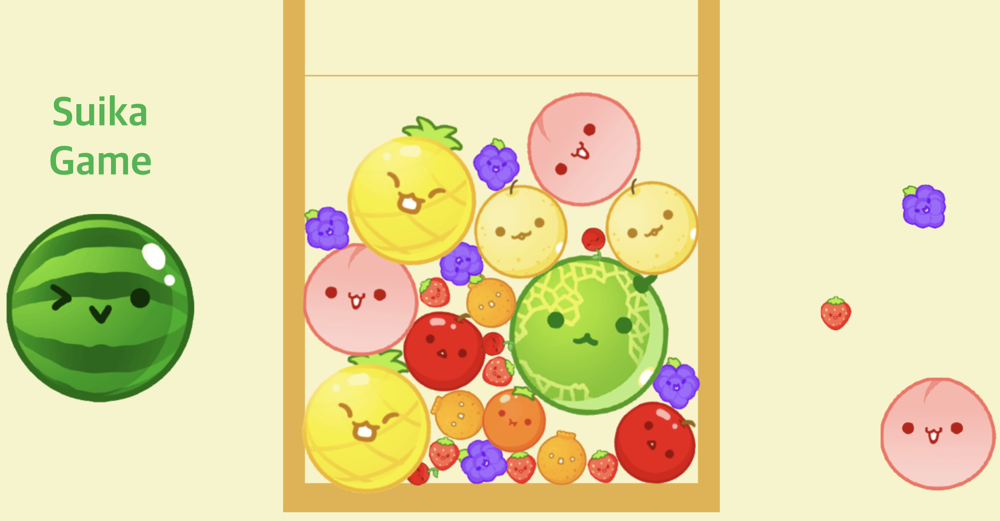

# 🍉 Suika-Game

닌텐도 Suika-Game을 웹버전으로 제작하였습니다.

## 👩🏻‍💻 개발자 소개

<table>
  <tbody>
    <tr>
      <td align="center"><a href="https://github.com/ziiYOU/"> <b> 방지영 </b></a> </td>
    </tr>
  </tbody>
</table>

## ⚙️ 기술 스택

## 📌 주요 기능

**1. matter-js** 라이브러리를 통해 물리엔진 구현. 
**2.** 충돌할 경우, 다음 과일로 생성. 
**3. 승리 조건 :** 수박 생성. 
**4. 패배 조건 :** top-Line에 과일이 닿았을 경우.

## 🎮 How to Play?

1. `← 왼쪽 키` , `→ 오른쪽 키` 를 사용하여 좌우 위치 조절.
2. `↓ 아래쪽 키` 를 사용하여 과일 떨어뜨리기.
3. 같은 과일끼리 부딪혀 다음 과일 생성하기.
4. Top-Line 에 닿기 전에 수박이 생성되면 승리!

